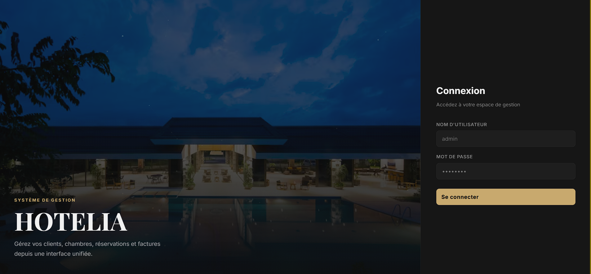
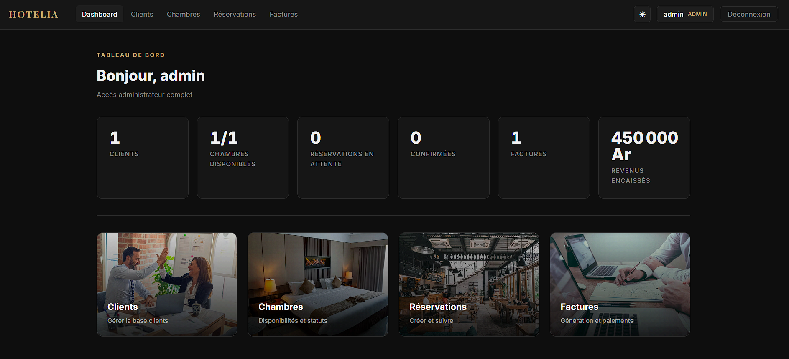
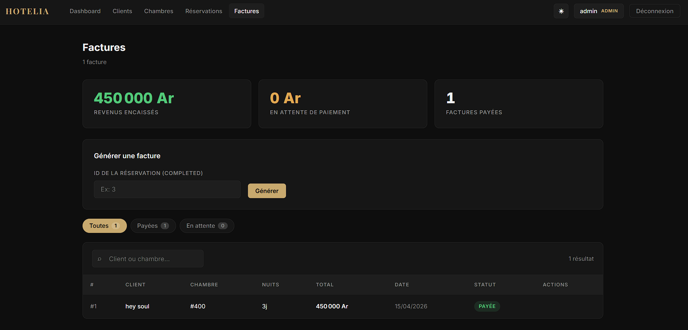

<div align="center">

[](https://github.com/lovasoarm)

<br/>


</div>

---

## À propos

**Hotelia** est un ERP hôtelier full-stack développé de A à Z.

Migration complète d'un système Java EE legacy vers une architecture moderne :

- **Backend** : API REST Spring Boot sécurisée avec JWT
- **Frontend** : SPA React.js avec dark mode, animations, images réelles
- **Infra** : Dockerisé et orchestré avec Docker Compose

L'app couvre l'intégralité des opérations d'un hôtel : clients, chambres, réservations, facturation et KPIs en temps réel.

---

## Fonctionnalités

| Module                | Détails                                                  |
| --------------------- | -------------------------------------------------------- |
| **Authentification**  | Login JWT, rôles ADMIN et RECEPTIONIST                   |
| **Clients**           | CRUD complet, recherche temps réel                       |
| **Chambres**          | Gestion des statuts (Available / Occupied / Maintenance) |
| **Réservations**      | Création, confirmation, annulation, fin de séjour        |
| **Factures**          | Génération automatique, paiement, résumé financier       |
| **Dashboard**         | KPIs live (revenus, occupancy, stats)                    |
| **Dark / Light mode** | Toggle persistant via localStorage                       |

---

## Stack technique

### Backend

```
Java 21 · Spring Boot 3.2.5 · Spring Security · JWT (jjwt 0.11.5)
Spring Data JPA · Hibernate · MySQL 8.0 · Maven
```

### Frontend

```
React.js 18 · React Router v6 · Axios
Inter + Playfair Display · CSS Variables (design tokens)
Canvas API (animations particules)
```

### DevOps

```
Docker · Docker Compose · Nginx (reverse proxy + SPA)
Build multi-stage (Maven → JRE Alpine / Node → Nginx Alpine)
```

---

## Architecture

```
hotelia-project/
├── backend/
│   ├── pom.xml
│   └── src/main/java/com/hotelia/backend/
│       ├── controller/        ← Endpoints REST
│       ├── service/           ← Logique métier
│       ├── repository/        ← Accès BDD (JPA)
│       ├── entity/            ← Entités JPA
│       ├── dto/               ← Request / Response
│       ├── security/          ← JWT Filter + Service
│       ├── config/            ← SecurityConfig
│       └── exception/         ← Global Exception Handler
│
├── frontend/
│   └── src/
│       ├── api/               ← Axios + intercepteurs
│       ├── components/        ← Navbar, Toast
│       ├── context/           ← AuthContext, ThemeContext
│       ├── pages/             ← Login, Dashboard, Clients...
│       └── styles/            ← global.css (design tokens)
│
├── assets/                    ← Screenshots
├── Dockerfile.backend
├── Dockerfile.frontend
├── docker-compose.yml
└── nginx.conf
```

**Flux de données :**

```
Browser → Nginx (port 3000)
       → /api/* → Spring Boot (port 8080) → MySQL (port 3306)
```

---

## Captures d'écran

#### Login



#### Dashboard



#### Factures



---

## Démarrage rapide

### Prérequis

- [Docker Desktop](https://www.docker.com/products/docker-desktop/) installé et lancé
- Git

### Lancer le projet

```bash
# 1. Cloner le repo
git clone https://github.com/lovasoarm/hotelia-project.git
cd hotelia-project

# 2. Lancer tous les services d'un coup
docker-compose up --build

# 3. Accéder à l'application
# Frontend  → http://localhost:3000
# Backend   → http://localhost:8080
# MySQL     → localhost:3307
```

### Créer le compte admin (première fois)

```bash
docker exec -it hotelia-mysql mysql -uroot -proot hotelia -e \
"INSERT IGNORE INTO users (username, password, role) \
VALUES ('admin', '\$2a\$10\$92IXUNpkjO0rOQ5byMi.Ye4oKoEa3Ro9llC/.og/at2.uheWG/igi', 'ADMIN');"
```

Identifiants : `admin` / `password`

---

## Sans Docker (mode développement)

### Backend

```bash
cd backend
mvn spring-boot:run
# → http://localhost:8080
```

> Nécessite MySQL en local sur le port 3306.  
> Modifier `src/main/resources/application.properties` si besoin.

### Frontend

```bash
cd frontend
npm install
npm start
# → http://localhost:3000
```

---

## Endpoints API

| Méthode  | Route                             | Description    | Auth   |
| -------- | --------------------------------- | -------------- | ------ |
| `POST`   | `/api/auth/login`                 | Connexion      | Public |
| `GET`    | `/api/clients`                    | Liste clients  | JWT    |
| `POST`   | `/api/clients`                    | Créer client   | JWT    |
| `DELETE` | `/api/clients/{id}`               | Supprimer      | ADMIN  |
| `GET`    | `/api/rooms`                      | Liste chambres | JWT    |
| `POST`   | `/api/rooms`                      | Créer chambre  | ADMIN  |
| `PATCH`  | `/api/rooms/{id}/status`          | Changer statut | ADMIN  |
| `GET`    | `/api/reservations`               | Liste          | JWT    |
| `POST`   | `/api/reservations`               | Créer          | JWT    |
| `PATCH`  | `/api/reservations/{id}/confirm`  | Confirmer      | JWT    |
| `PATCH`  | `/api/reservations/{id}/cancel`   | Annuler        | JWT    |
| `PATCH`  | `/api/reservations/{id}/complete` | Terminer       | JWT    |
| `GET`    | `/api/invoices`                   | Liste factures | JWT    |
| `POST`   | `/api/invoices/generate/{resId}`  | Générer        | JWT    |
| `PATCH`  | `/api/invoices/{id}/pay`          | Marquer payée  | JWT    |
| `GET`    | `/api/stats`                      | KPIs dashboard | JWT    |

---

## Variables d'environnement

| Variable                     | Par défaut                        | Description      |
| ---------------------------- | --------------------------------- | ---------------- |
| `SPRING_DATASOURCE_URL`      | `jdbc:mysql://mysql:3306/hotelia` | URL MySQL        |
| `SPRING_DATASOURCE_USERNAME` | `root`                            | User MySQL       |
| `SPRING_DATASOURCE_PASSWORD` | `root123`                         | Mot de passe     |
| `APP_JWT_SECRET`             | `hoteliaSecretKey2024...`         | Clé JWT HMAC     |
| `APP_JWT_EXPIRATION`         | `86400000`                        | Durée token (ms) |

---

## Commandes Docker utiles

```bash
# Logs en temps réel
docker-compose logs -f

# Logs d'un service spécifique
docker-compose logs -f backend

# État des conteneurs
docker-compose ps

# Arrêter tout
docker-compose down

# Arrêter + supprimer les données MySQL
docker-compose down -v

# Rebuilder un seul service après modif
docker-compose up --build backend
```

---

## Difficultés rencontrées

**Lombok incompatible avec l'environnement**  
Les annotations `@Getter`, `@Setter`, `@RequiredArgsConstructor` ne se traitaient pas correctement dans IntelliJ + Maven. Décision : suppression complète et réécriture manuelle de tous les constructeurs et accesseurs sur les 43 fichiers Java.

**Timing Docker MySQL → Spring Boot**  
Spring Boot démarrait avant que MySQL soit prêt → exception de connexion. Solution : healthcheck `mysqladmin ping` sur MySQL + `depends_on: condition: service_healthy` sur le backend.

**CORS en production Docker**  
En local tout marche, en Docker les ports diffèrent. Solution : Nginx configuré comme reverse proxy `/api/` → `backend:8080`. Le frontend ne parle plus directement au backend. Zéro CORS.

**Version Spring Boot invalide**  
`pom.xml` déclarait Spring Boot `4.0.5` (inexistant). Fix : vérification sur Maven Central → `3.2.5`.

---

## Ce que j'ai appris

- Concevoir une API REST complète avec sécurité JWT bout en bout
- Architecture en couches stricte : Controller / Service / Repository / DTO
- React.js avec hooks, Context API, intercepteurs Axios
- Docker multi-stage builds, Docker Compose, Nginx reverse proxy
- Diagnostiquer des problèmes réels (pas juste coder)

---

## Auteur

<div align="center">

**Lovasoarm AKA `Aramis`**  


</div>

---


